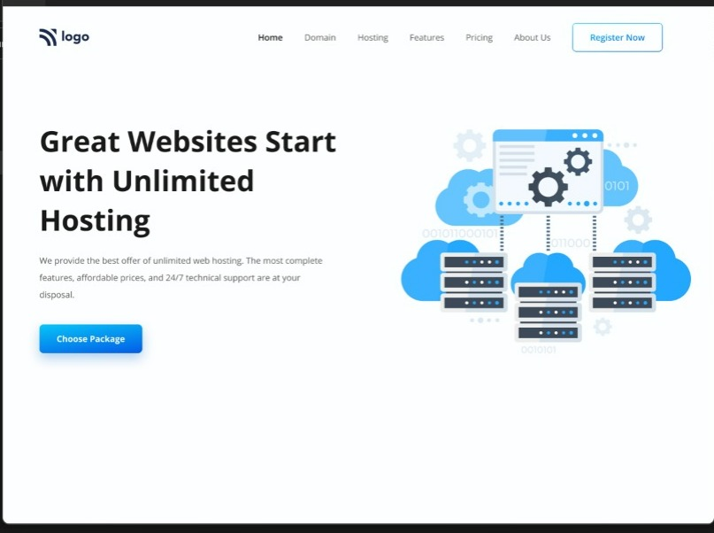
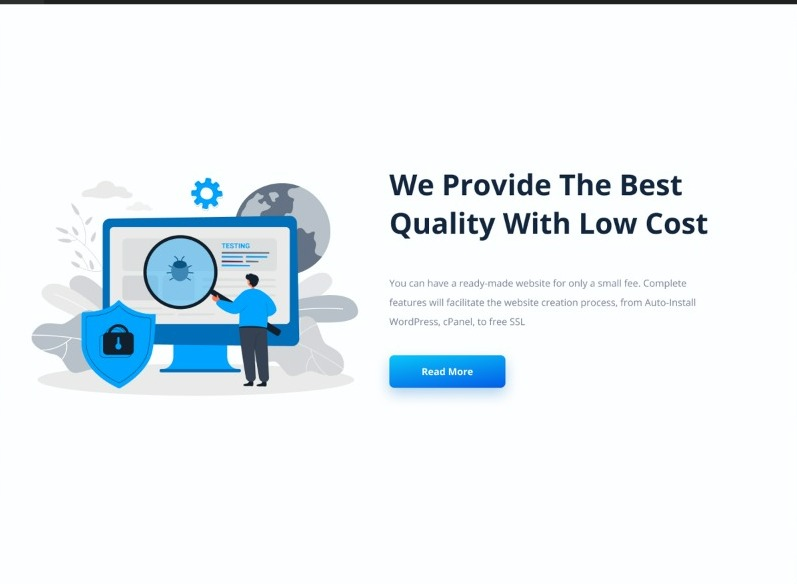
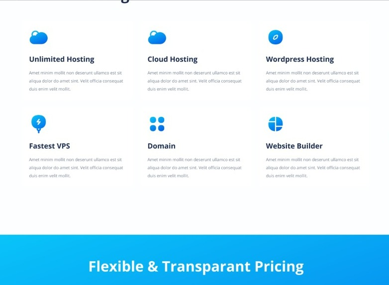
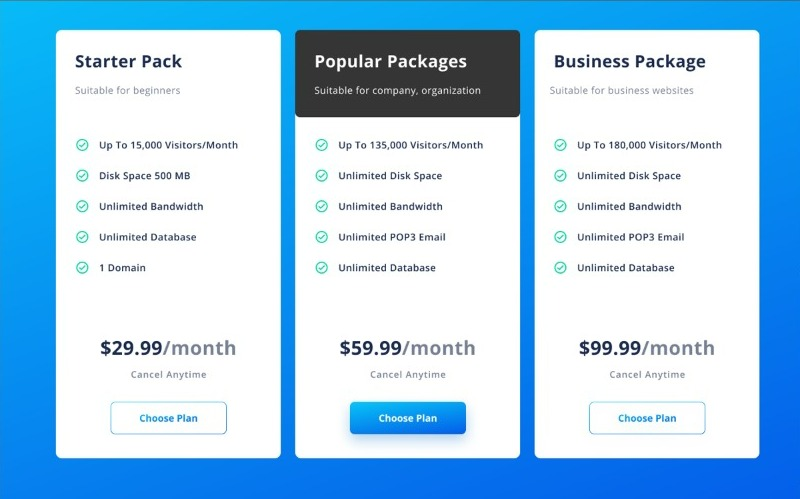
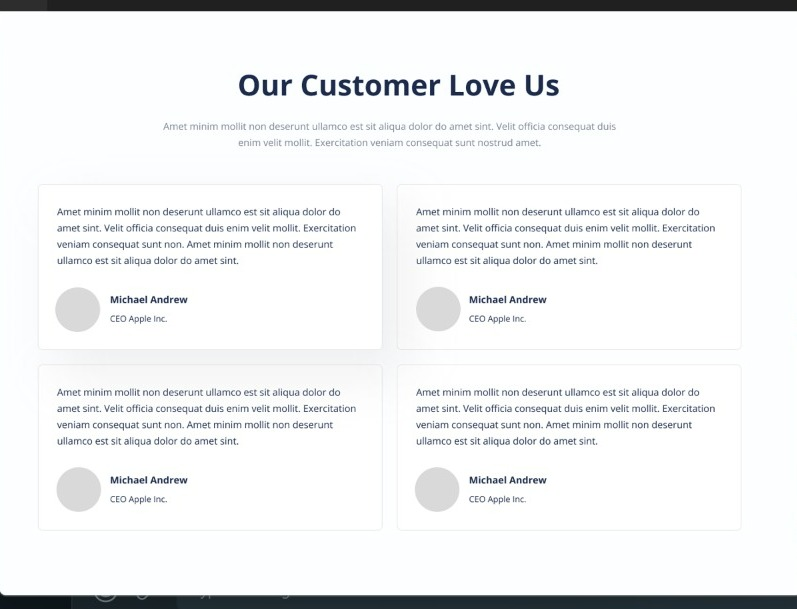
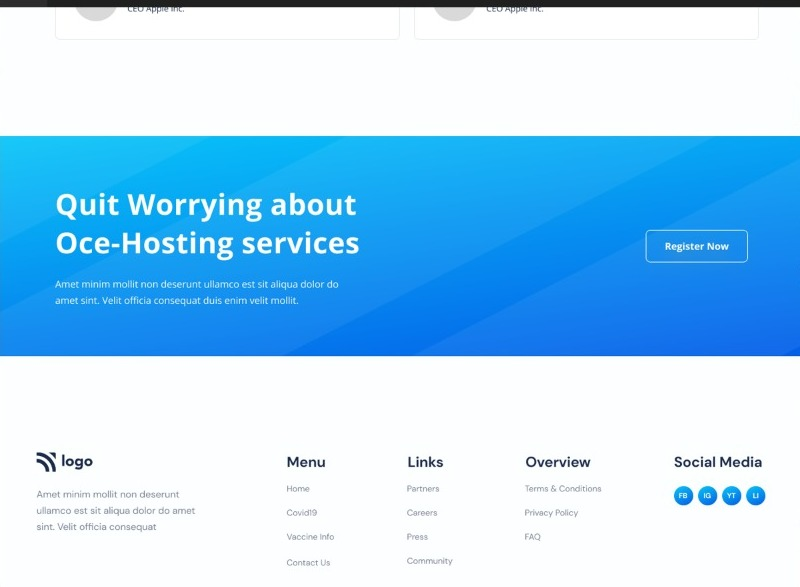

# Project 11

## This is the design which is given to convert into a web page👇

### It takes me 2 days to complete this project and also introduced me into some of the important css properties such as CSS Selectors, Positions and a little bit of flexbox too.

#### *In case you are interested in this project, feel free to use these files for educational purposes*👍
👉[**Link to the Webpage**](https://lcoproject1.netlify.app/)

